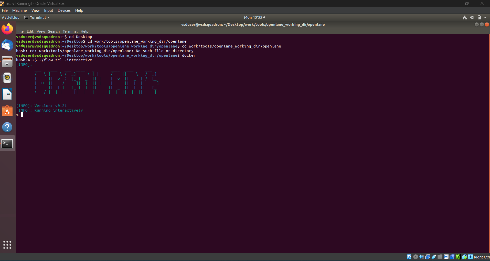
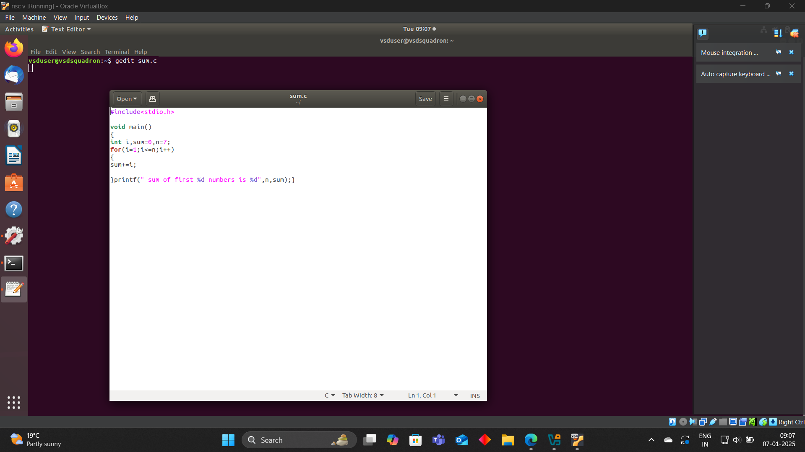
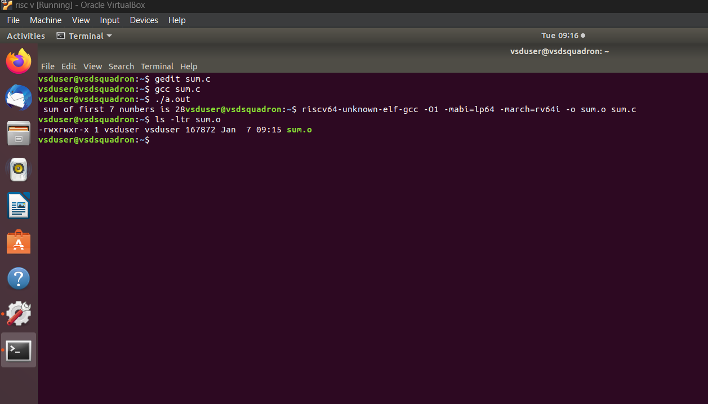
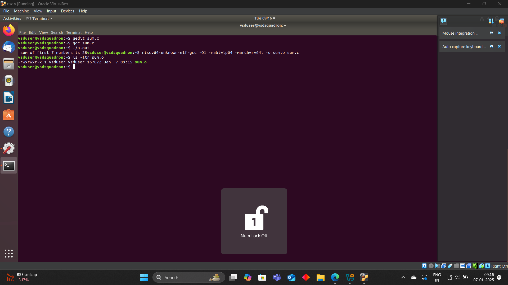
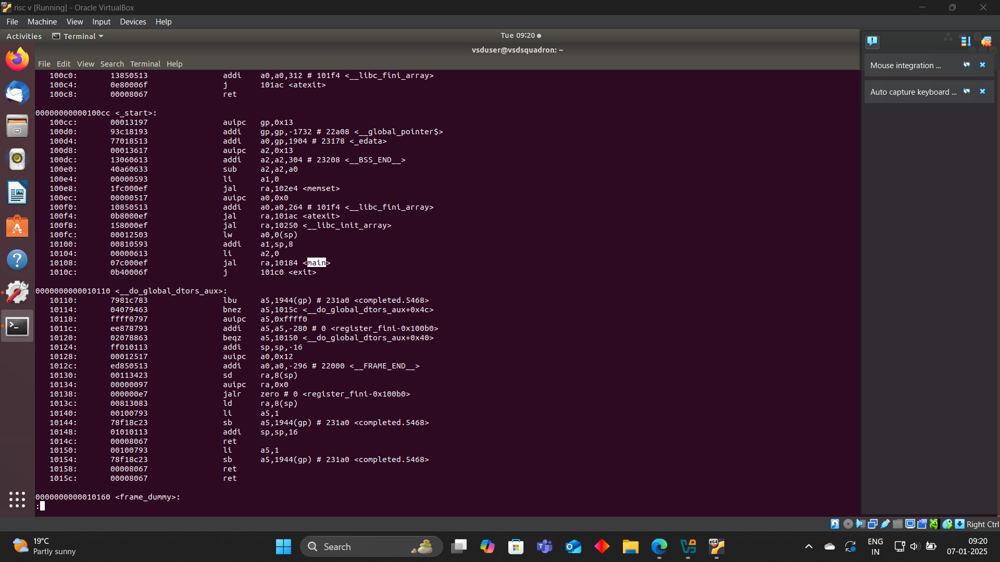
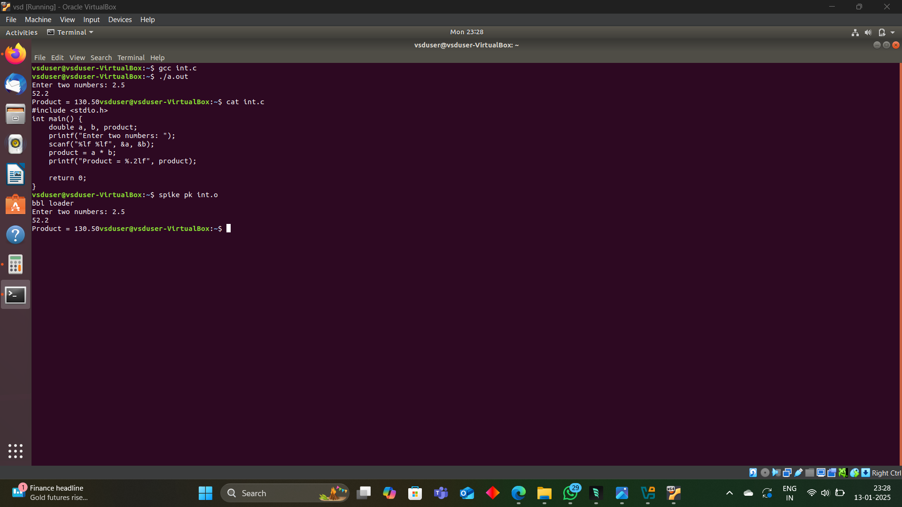
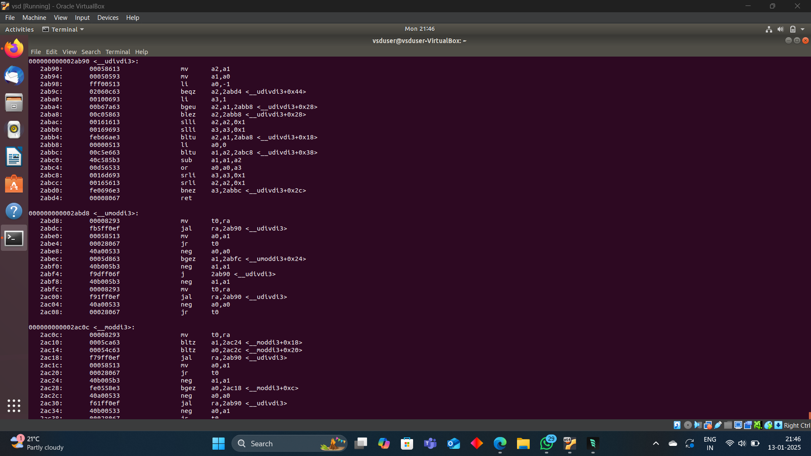
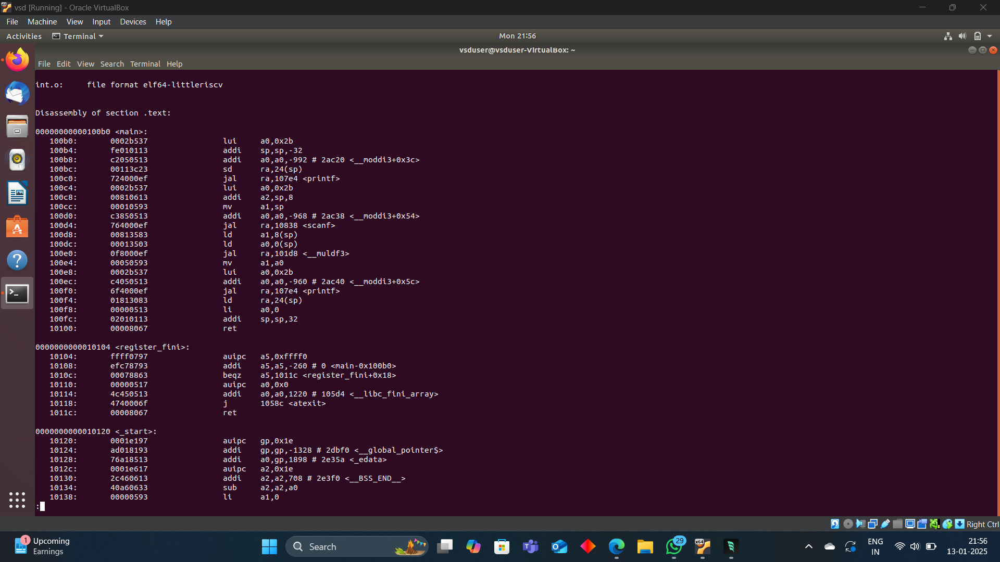

# Samsung RISC-V Project

<div align="center">
  
  <br>
  
  
  
</div>

## Overview
This repository contains RISC-V implementation and development resources focused on Samsung's RISC-V initiatives. RISC-V is an open standard instruction set architecture (ISA) based on established reduced instruction set computer (RISC) principles.

<div align="center">
  
</div>

## Features
- RISC-V core implementation with support for:
  <div align="center">
    
  </div>
  - 32-bit and 64-bit support
  - Multiple privilege levels
  - Custom extensions support
- Development tools and utilities
  - Compiler toolchain
  - Debugger integration
  - Performance analysis tools
- Documentation and resources
- Example programs and test cases
- Simulation environment

## Prerequisites
- RISC-V GNU Toolchain
- RISC-V simulator (optional)
- Basic understanding of computer architecture and ISA
- Git version control
- Make build system
- Python 3.x for development tools

## Getting Started
1. Clone the repository:
   ```bash
   git clone https://github.com/MONISHKV/samsung-riscv.git
   cd samsung-riscv
   ```

2. Set up the development environment:
   ```bash
   # Install dependencies
   make setup

   # Build the project
   make build

   # Run tests
   make test
   ```

3. Explore example programs:
   ```bash
   cd examples
   make run PROGRAM=hello_world
   ```

## Project Structure
```
samsung-riscv/
├── assets/         # Project assets and images
│   └── images/     # Repository images
├── docs/           # Documentation files
│   ├── api/        # API documentation
│   └── guides/     # User guides
├── src/            # Source code
│   ├── core/       # RISC-V core implementation
│   ├── extensions/ # Custom extensions
│   └── peripherals/# Hardware peripherals
├── tests/          # Test cases
│   ├── unit/      # Unit tests
│   └── integration/# Integration tests
├── tools/          # Development tools
└── examples/       # Example programs
```

## Documentation
- [Getting Started Guide](docs/guides/getting-started.md)
- [Architecture Overview](docs/guides/architecture.md)
- [API Reference](docs/api/README.md)
- [Contributing Guidelines](CONTRIBUTING.md)

## Implementation Details
<div align="center">
  
</div>

## Development Workflow
<div align="center">
  
</div>

## Tasks Progress
### ✅ Task 1: Initial Setup and Core Implementation
- Completed basic RISC-V core setup
- Implemented fundamental architecture components
- Verified basic functionality
### ✅ Task 2: C Code Compilation with RISCV
We have to follow the given steps to compile any **.c** file in our machine:  

1. Open the bash terminal and locate to the directory where you want to create your file. Then run the following command:
   ```
   gedit sum.c
   ```  

2. This will open the editor and allows you to write into the file that you have created. You have to write the C code of printing the sum of n numbers. Once you are done with your code, press `Ctrl + S` to save your file, and then press `Ctrl + W` to close the editor.   

3. To compile the C code on your terminal, run the following command:
   ```
   gcc sum.c
   ./a.out
   ```

### RISCV based LAB
We have to do the same compilation of our code but this time using RISCV gcc compiler. Follow the given steps:  

1. Open the terminal and run the given command:  
   ```
   cat sum.c
   ```
   And to compile the code using **riscv compiler**, use the following command:  
```
spike pk sum.o
```  
### Spike Simulation:
<div align="center">
  
</div>

2. Using the **cat** command, the entire C code will be displayed on the terminal. Now run the following command to compile the code in riscv64 gcc compiler:  
   ```
   riscv64-unknown-elf-gcc -O1 -mabi=lp64 -march=rv64i -o sum.o sum.c
   ```
 <div align="center">
  
</div>

3. Open a new terminal and run the given command:    
   ```
   riscv64-unknown-elf-objdump -d sum.o
   ```
  
4. Open the previous tab and run the following command to compile the code in riscv64 gcc compiler:  
   ```
   riscv64-unknown-elf-gcc -Ofast -mabi=lp64 -march=rv64i -o sum.o sum.c
   ```
 <div align="center">
  
</div>

5. Open a new terminal and run the given command:    
   ```
   riscv64-unknown-elf-objdump -d sum.o
   ```


-------------------------------------------------


----------------------------------------

### 🔄 Upcoming Tasks
- Task 3: [Future Implementation]
- Task 4: [Future Implementation]
- Task 5: [Future Implementation]
- Task 6: [Future Implementation]

## Contributing
Contributions are welcome! Please feel free to submit a Pull Request. For major changes, please open an issue first to discuss what you would like to change.

## License
This project is licensed under the MIT License - see the [LICENSE](LICENSE) file for details.

## Acknowledgments
- Samsung Electronics for the initiative
- RISC-V International for the ISA specification
- All contributors to this project

## Contact
For any queries or suggestions, please open an issue in the GitHub repository.

---
<div align="center">
  <sub>Built with ❤️ for Samsung RISC-V Project</sub>
</div>
